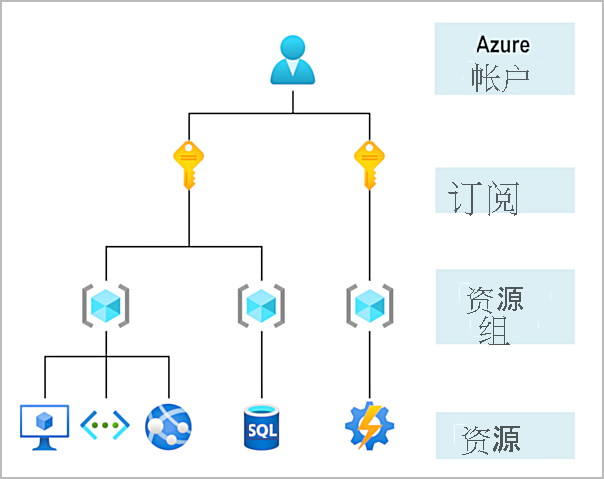
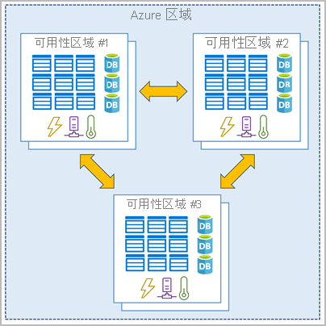
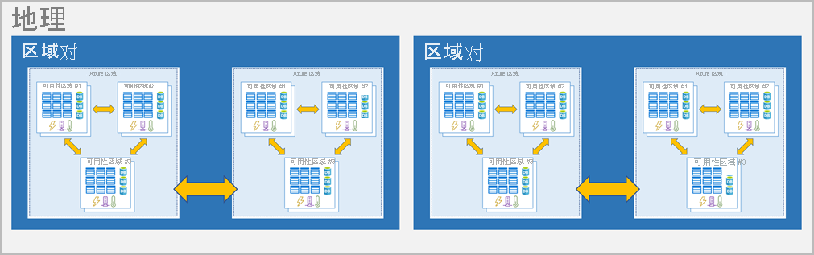

# Microsoft Azure 基础知识

## 1. Azure 核心概念

### 1.1. Azure 基础知识

### 1.2. 不同类型的云模型

> ## 什么是公有云、私有云和混合云？

| 部署模型 | 说明                                                         |
| -------- | ----------------------------------------------------------- |
| 公有云   | 通过公共 Internet 提供服务，可供任何想要购买的人使用。 云资源（如服务器和存储）为第三方云服务提供商所有并且由其运营，并通过 Internet 提供。 |
| 私有云   | 私有云由计算资源组成，这些资源专供某个企业或组织的用户使用。 私有云可实际位于组织的现场（本地）数据中心，也可由第三方服务提供商托管。 |
| 混合云   | 混合云是一种计算环境，允许数据和应用程序相互进行共享，融合了公有云和私有云。 |

> 云模型比较
+ 公有云
  - 不需要资本支出即可扩大规模。

  - 可以快速地预配和取消预配应用程序。

  - 组织只需为其使用的内容付费。
+ 私有云
  - 必须购买硬件才能启动和维护。

  - 组织可全面控制资源和安全性。

  - 组织负责硬件维护和更新。
+ 混合云
  - 提供最大的灵活性。

  - 组织确定运行应用程序的位置。

  - 组织控制安全性、符合性或法律要求。

### 1.3 云的优点和注意事项

> 云计算有哪些优势？

+ 高可用性 High availability：根据你选择的服务级别协议 (SLA)，基于云的应用可以提供持续的用户体验，即使在出现故障时也不会有明显的停机时间。

+ 可伸缩性 Scalability：云中的应用可以垂直或水平缩放：

	> 垂直缩放可以通过向虚拟机添加 RAM 或 CPU 增加计算容量。
	> 水平缩放可以通过添加资源实例（例如将 VM 添加到配置中）来增加计算能力。

+ 弹性 Elasticity：可以将基于云的应用配置根据需要自动缩放，使应用始终具有所需的资源。

+ 敏捷性 Agility：根据应用需求的变化，快速部署和配置基于云的资源。

+ 地区分发 Geo-distribution：可以将应用和数据部署到全球各地的区域数据中心，从而确保客户在其区域中始终具有最佳性能。

+ 灾难恢复 Disaster recovery：通过利用基于云的备份服务、数据复制和地理分布，你可以放心地部署应用，因为你知道在发生灾难时数据是安全的。

> 资本费用与运营费用

+ 资本支出 (CapEx) 是指花在实体基础设施上的前期支出，然后逐渐扣除这笔前期费用。 CapEx 的前期成本的价值会随着时间的推移而降低。
+ 运营支出 (OpEx) 是现在花钱购买服务或产品，现在为其付费。 可以在消费的当年扣除此费用。 你可以在使用服务或产品时为其付费，无前期成本。

> 云计算是一种基于使用的模型

### 1.4 其他云服务

> 云服务模型

| Model | 定义                                          | 说明                                                         |
| ----- | --------------------------------------------- | ------------------------------------------------------------ |
| IaaS  | 基础结构即服务(*Infrastructure-as-a-Service*) | 此云服务模型是最接近于管理物理服务器的；云提供商将保持硬件是最新的，但是操作系统维护和网络配置则需要作为云租户的你完成。 例如，Azure 虚拟机是在 Microsoft 数据中心中运行的完全可操作的虚拟计算设备。 这种云服务模型的优点是快速部署新的计算设备。 设置新虚拟机比采购、安装和配置物理服务器快得多。 |
| PaaS  | 平台即服务(*Platform-as-a-Service*)           | 这种云服务模型是一种托管主机环境。 云提供商管理虚拟机和网络资源，云租户将其应用程序部署到托管主机环境中。 例如，Azure 应用服务提供托管的主机环境，开发人员可在其中上传其 Web 应用程序而无需担心物理硬件和软件要求。 |
| SaaS  | 软件即服务(*Software-as-a-Service*)           | 在这种云服务模型中，云提供商管理应用程序环境的所有方面，如虚拟机、网络资源、数据存储和应用程序。 云租户只需向由云提供商管理的应用程序提供数据。 例如，Microsoft Office 365 提供在云中运行的 Microsoft Office 的完全可用版本。 你只需创建内容，Office 365 会处理其他所有事项。 |

> 可以在每个云服务模型中运行的服务

> 云服务模型比较

### 1.5 Azure 订阅、管理组和资源

> Azure 中资源的组织结构，它具有四个级别：管理组、订阅、资源组和资源。

+ 资源 Resources：资源是你创建的服务的实例，如虚拟机、存储或 SQL 数据库。
+ 资源组 Resource groups：资源合并成为资源组，资源组充当在其中部署和管理 Azure 资源（如 Web 应用、数据库和存储帐户）的逻辑容器。
+ 订阅 Subscriptions：订阅将用户帐户和这些用户帐户创建的资源组合在一起。 对于每个订阅，你可以创建和使用的资源量有限制或配额。 组织可以使用订阅来管理成本，或者由用户、团队或项目创建的资源。
+ 管理组 Management groups：这些组有助于你管理多个订阅的访问、策略和合规性。 管理组中的所有订阅都会自动继承应用于管理组的条件。

### 1.6 Azure 区域、可用性区域和区域对

> Azure 区域

+ 区域是指地球上的某个地理区域，包含至少一个（但很可能是多个）数据中心，这些数据中心彼此相邻并通过一个低延迟的网络相互连接。 Azure 智能地分配和控制每个区域内的资源，以确保适当平衡工作负载。

> Azure 可用性区域

+ 你希望确保服务和数据是冗余的，以便在发生故障时能够保护信息。 托管基础结构时，设置自己的冗余需要创建重复的硬件环境。 Azure 可以通过可用性区域帮助实现应用的高可用性。

> Azure 区域对

+ 可用性区域是使用一个或多个数据中心创建的。 单个区域内最少有三个地区。 一场大灾难可能会引发足够严重的中断，甚至影响到两个数据汇中心。 这就是 Azure 还要创建区域对的原因。

### 1.7 Azure 资源和 Azure 资源管理器

+ 资源：可通过 Azure 获取的可管理项。 虚拟机 (VM)、存储帐户、Web 应用、数据库和虚拟网络是资源示例。
+ 资源组：用于保存 Azure 解决方案相关资源的容器。 资源组包括你想要作为组进行管理的资源。 根据最适合组织的情况来决定哪些资源属于哪个资源组。

+ Azure 资源管理器

## 2. Azure 核心服务

### 2.1 Azure 计算服务

#### 2.1.1 虚拟机 Virtual machines

虚拟机是物理计算机的软件模拟。 它们包括虚拟处理器、内存、存储和网络资源。 VM 托管一个操作系统，你可以像使用物理计算机一样安装和运行软件。 使用远程桌面客户端时，可以像坐在终端前面一样使用和控制 VM。

使用 Azure 虚拟机，可以在云中创建和使用 VM。 虚拟机提供基础设施即服务 (IaaS)，并可以按不同方式使用。 在需要完全控制操作系统和环境时，VM 是一种理想选择。 就像物理计算机一样，可以自定义在 VM 上运行的所有软件。 运行自定义软件或自定义托管配置时，此功能很有帮助。

#### 2.1.2 虚拟机规模集 Virtual machine scale sets

虚拟机规模集是一种 Azure 计算资源，可用于部署和管理一组相同的 VM。 虚拟机缩放集旨在在所有 VM 配置相同的情况下，实现真正意义上的自动缩放。 无需对 VM 进行预配。 出于此原因，可以更方便地构建面向大型计算、大数据、容器化工作负荷的大规模服务。 随着需求的增加，可以添加更多的 VM 实例。 随着需求的下降，可以删除 VM 实例。 此过程可通过手动、自动或两者结合的方式实现。

#### 2.1.3 容器和 Kubernetes Containers and Kubernetes

容器实例和 Azure Kubernetes 服务是可用于部署和管理容器的 Azure 计算资源。 容器是轻型的虚拟化应用程序环境。 它们的设计旨在实现快速创建、横向扩展和动态停止。 可以在单个主机上运行容器化应用程序的多个实例。

#### 2.1.4 应用服务 App Service

利用 Azure 应用服务，可快速生成、部署和缩放任何平台上运行的企业级 Web 应用、移动应用和 API 应用。 在使用完全托管的平台执行基础结构维护的同时，可以满足严苛的性能、可伸缩性、安全性和合规性要求。 应用服务是一种平台即服务 (PaaS) 服务。

#### 2.1.5 函数 Functions

若只关心运行服务的代码，而不关心基础平台或基础结构，Functions 是理想选择。 需要执行工作以响应事件（通常通过 REST 请求）、计时器或来自其他 Azure 服务的消息，并且该工作可在几秒钟或更短时间内快速完成时，通常会用到它们。

### 2.2 Azure 网络服务 

### 2.3 Azure 存储服务

> 要开始使用 Azure 存储，首先要创建 Azure 存储帐户以存储数据对象。 可以使用 Azure 门户、PowerShell 或 Azure CLI 创建 Azure 存储帐户。
>
> 存储帐户将包含所有 Azure 存储数据对象，例如 blob、文件和磁盘。

#### 2.3.1 Azure Blob 存储

> Azure Blob 存储是适用于云的对象存储解决方案。 它可以存储海量数据，例如文本或二进制数据。 Azure Blob 存储是非结构化的，这意味着它可保存各种类型的数据。 Blob 存储可以管理数千个同步上传、大量视频数据以及不断增长的日志文件，并且你可以通过 Internet 连接从任意位置访问它。

> Blob 存储最适合用于：

+ 直接向浏览器提供图像或文档。
+ 存储文件以供分布式访问。
+ 对视频和音频进行流式处理。
+ 存储用于备份和还原、灾难恢复及存档的数据。
+ 存储数据以供本地或 Azure 托管服务执行分析。
+ 为虚拟机存储多达 8 TB 的数据。

#### 2.3.2 Azure 文件存储基础

> Azure 文件存储在云端提供完全托管的文件共享，这些共享可通过行业标准的服务器消息块和网络文件系统（预览）协议进行访问。 

> 在以下情况下使用 Azure 文件存储：

+ 许多本地应用程序使用文件共享。 借助 Azure 文件存储可以更方便地迁移将数据共享到 Azure 的应用程序。 如果将 Azure 文件共享装载到本地应用程序使用的相同驱动器号，则访问该文件共享的应用程序部分应只需要进行最少的更改（如果有）。
+ 将配置文件存储在文件共享上，并从多个 VM 进行访问。 可以将一个组中多个开发人员使用的工具和实用程序存储到文件共享中，确保每个人都能找到它们并使用同一版本。
+ 将数据写入文件共享，稍后处理或分析数据。 例如，你可能希望对诊断日志、指标和故障转储执行此操作。

#### 2.3.3 Blob 访问层

> Azure 存储为 blob 存储提供不同的访问层，有助于以最经济高效的方式存储对象数据。 可用的访问层包括：

- **热访问层**：针对存储经常访问的数据（例如网站图像）进行了优化。
- **冷访问层**：为不常访问且存储时间至少为 30 天的数据（例如客户发票）进行了优化。
- **存档访问层**：适用于极少访问、存储时间至少为 180 天且延迟要求不严格的数据（例如长期备份）。

>  以下注意事项适用于不同的访问层：

- 在帐户级别只能设置热和冷访问层。 存档访问层在帐户级别不可用。
- 可以在上传期间或上传后在 Blob 级别设置热层、冷层和存档层。
- 冷访问层中的数据可容许略低的可用性，但仍需类似于热数据的高持久性、检索延迟和吞吐量特征。 对于冷数据，略低的可用性服务级别协议 (SLA) 和较高的访问成本（与热数据相比）对于更低的存储成本而言是可接受的折衷。
- 存档存储可脱机存储数据，其存储费用最低，但数据解除冻结和访问费用最高。

### 2.4 Azure 数据库和分析服务

## 3. Azure 上的核心解决方案和管理工具

### 3.1 Azure IoT 服务

#### 3.1.1 IoT 中心 IoT Hub

#### 3.1.2 IoT Central

#### 3.1.3 Azure Sphere

### 3.2 AI 服务

### 3.3  Azure 无服务器技术

#### 3.3.1 Azure Functions

#### 3.3.2 Azure 逻辑应用

---

使用 Azure Functions3 分钟
使用 Azure 逻辑应用

ad
